---
tags:
  - distributed-system
  - java
  - socket
  - javafx
  - report
  - baocao
aliases:
  - Báo cáo Hệ thống Phân tán
  - Distributed System Report
created: 2026-02-20
updated: 2026-02-20
cssclasses:
  - distributed-system-report
  - colorful-admonitions
---

# 📚 BÁO CÁO ĐỒ ÁN
# HỆ THỐNG PHÂN TÁN ĐA SERVER CHO PHÉP TRUY XUẤT CƠ SỞ DỮ LIỆU LỚN

> [!abstract]+ 📌 Thông tin đồ án
> - **Đề tài**: Đề 13 - Xây dựng hệ thống theo mô hình đa Server cho phép truy xuất cơ sở dữ liệu lớn
> - **Ngôn ngữ**: Java
> - **Công nghệ chính**: TCP Socket, JavaFX, MySQL, Gradle Multi-module
> - **Số Server**: 4 (1 Load Balancer + 2 Worker + 1 Database)

---

# CHƯƠNG 1: TỔNG QUAN VÀ CÔNG NGHỆ SỬ DỤNG

## 1.1 Giới thiệu đề tài

### 1.1.1 Đặt vấn đề

> [!info]+ Bối cảnh
> Trong bối cảnh phát triển phần mềm hiện đại, xu hướng chuyển dịch sang các ứng dụng nền web (Web-based applications) và kiến trúc vi dịch vụ (Microservices) đang chiếm ưu thế nhờ khả năng triển khai linh hoạt và tính sẵn sàng cao.

Tuy nhiên, tồn tại một phân khúc quan trọng các hệ thống nghiệp vụ yêu cầu:
- **Hiệu năng xử lý thời gian thực** (Real-time processing)
- **Độ trễ thấp** (Low latency)
- **Khả năng tương tác phần cứng sâu**

Chỉ các ứng dụng Desktop (Native Applications) mới có thể đáp ứng tối ưu các yêu cầu này.

### 1.1.2 Mục tiêu đề tài

> [!success]+ Mục tiêu chính
> Xây dựng hệ thống phân tán bao gồm **4 máy chủ (Server)** và cơ sở dữ liệu lớn, phục vụ **Client là ứng dụng Desktop** viết bằng Java (JavaFX), hoàn toàn **không sử dụng công nghệ Web (HTTP/REST)**, mà dựa trên **giao thức giao vận mức thấp (TCP Socket)**.

**Các yêu cầu cụ thể:**
1. Triển khai 4 Server và cơ sở dữ liệu
2. Chương trình Client cho phép thực hiện truy xuất và cập nhật
3. Xử lý cân bằng tải trọng giữa các Server
4. Xử lý đồng bộ dữ liệu

### 1.1.3 Phạm vi nghiên cứu

```
┌─────────────────────────────────────────────────────────────────┐
│                    PHẠM VI HỆ THỐNG                             │
├─────────────────────────────────────────────────────────────────┤
│  ✅ Trong phạm vi:                                              │
│     - Giao tiếp TCP Socket thuần túy                           │
│     - Load Balancing (Round Robin)                              │
│     - Connection Pooling (HikariCP)                            │
│     - Desktop Client (JavaFX)                                   │
│     - CRUD operations trên MySQL                               │
│                                                                  │
│  ❌ Ngoài phạm vi:                                              │
│     - HTTP/REST API                                             │
│     - Web Client (Browser)                                      │
│     - Database Replication thực tế                             │
│     - SSL/TLS encryption                                        │
└─────────────────────────────────────────────────────────────────┘
```

---

## 1.2 Công nghệ sử dụng

> [!tip]+ Tech Stack

### 1.2.1 Bảng tổng hợp công nghệ

| Công nghệ | Version | Mục đích sử dụng |
|-----------|---------|------------------|
| **Java** | 21 | Ngôn ngữ lập trình chính (LTS) |
| **JavaFX** | 21 | Framework GUI cho Desktop Client |
| **Gradle** | 8.x (Wrapper) | Build tool, quản lý dependencies |
| **MySQL** | 8.0 | Hệ quản trị cơ sở dữ liệu |
| **Jackson** | 2.15.2 | JSON serialization/deserialization |
| **Lombok** | 1.18.30 | Giảm boilerplate code cho DTOs |
| **HikariCP** | 5.0.1 | Connection pooling hiệu năng cao |
| **MySQL Connector/J** | 8.0.33 | JDBC Driver cho MySQL |
| **SLF4J** | 2.0.9 | Logging framework |
| **ControlsFX** | 11.1.2 | Thư viện UI components cho JavaFX |
| **Docker** | Latest | Container hóa MySQL server |

### 1.2.2 Lý do chọn công nghệ

> [!example]+ Java 21 + JavaFX 21

**Tại sao Java 21?**
- **LTS (Long-Term Support)**: Được hỗ trợ dài hạn, ổn định cho production
- Đáp ứng yêu cầu đề bài (Java hoặc C#)
- Cross-platform: chạy trên Windows, Linux, macOS
- Hỗ trợ mạnh mẽ cho lập trình mạng (java.net.Socket)
- Ecosystem phong phú với nhiều thư viện chất lượng
- **Virtual Threads** (Project Loom): Tương lai của concurrent programming

**Tại sao JavaFX thay vì Swing?**
- Modern UI framework với CSS styling
- FXML cho tách biệt UI và logic
- Hardware-accelerated graphics
- Better MVC/MVP support

> [!example]+ Gradle thay vì Maven

- **Cú pháp Groovy/Kotlin DSL**: ngắn gọn hơn XML của Maven
- **Build nhanh hơn**: Incremental builds, build cache
- **Multi-module support**: Dễ dàng quản lý project có nhiều module
- **Task customization**: Linh hoạt định nghĩa tasks (runWorker1, runWorker2)

> [!example]+ HikariCP cho Connection Pooling

- **Hiệu năng cao nhất** trong các connection pool libraries
- **Lightweight**: ~130KB, không dependencies nặng
- **Cấu hình đơn giản**: Convention over configuration
- **Production-ready**: Được sử dụng bởi Spring Boot default

> [!example]+ TCP Socket thay vì HTTP/REST

| Tiêu chí | TCP Socket | HTTP/REST |
|----------|------------|-----------|
| Overhead | Rất thấp | Cao (HTTP headers) |
| Latency | Thấp nhất | Trung bình |
| Connection | Persistent | Thường stateless |
| Kiểm soát | Toàn diện | Bị giới hạn bởi HTTP spec |
| Phù hợp | Real-time, Desktop | Web, Mobile |

---

## 1.3 Kiến trúc tổng quan hệ thống

### 1.3.1 Sơ đồ kiến trúc

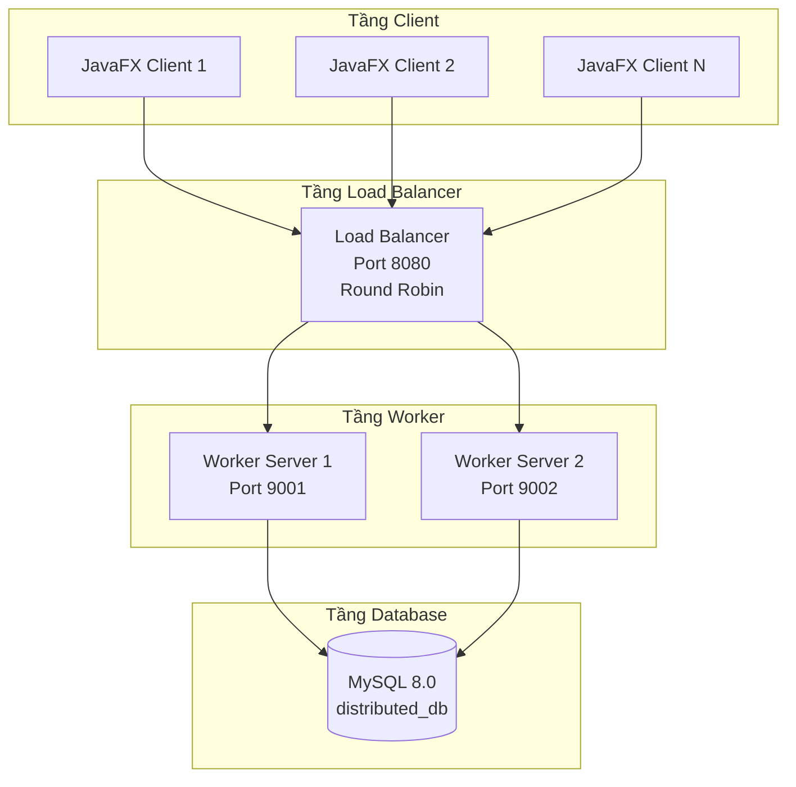

### 1.3.2 Mô tả các thành phần

> [!note]+ Phân bổ 4 Server

| Server | Vai trò | Port | Mô tả |
|--------|---------|------|-------|
| **Server 1** | Load Balancer | 8080 | Gateway, phân phối request |
| **Server 2** | Worker Node 1 | 9001 | Xử lý nghiệp vụ, truy xuất DB |
| **Server 3** | Worker Node 2 | 9002 | Xử lý nghiệp vụ, truy xuất DB |
| **Server 4** | Database | 3306 | MySQL Server |

### 1.3.3 Cấu trúc Project (Multi-module Gradle)

```
distributed-system-root/
├── build.gradle              # Root build file
├── settings.gradle           # Module configuration
├── config.properties.example # Template cấu hình mạng
├── docker-compose.yml        # MySQL + phpMyAdmin
│
├── common-lib/               # 📦 Shared Library
│   └── src/main/java/org/example/common/
│       ├── PacketUtils.java      # Length-Prefix Framing
│       ├── RequestPayload.java   # Request DTO
│       ├── ResponsePayload.java  # Response DTO
│       ├── UserDTO.java          # User entity
│       ├── Commands.java         # Command constants
│       └── NetworkConfig.java    # Config loader
│
├── server-node/              # 🖥️ Worker Server
│   └── src/main/java/org/example/
│       ├── WorkerServer.java     # Main server
│       ├── ClientHandler.java    # Request handler
│       └── DatabaseConnection.java
│
├── load-balancer/            # ⚖️ Load Balancer
│   └── src/main/java/org/example/
│       └── LoadBalancer.java
│
├── javafx-client/            # 🖼️ Desktop Client
│   └── src/main/java/org/example/
│       ├── ClientApplication.java
│       ├── ClientLauncher.java
│       ├── ClientController.java
│       └── SocketClient.java
│
└── database/
    └── setup.sql             # Schema + sample data
```

---

## 1.4 Cơ chế chia sẻ dữ liệu giữa 4 máy (Data Sharing)

> [!abstract]+ Yêu cầu đề bài
> *"4 server ở đây có thể coi là 4 máy của 4 thành viên trong nhóm"*
> 
> Hệ thống phải cho phép 4 máy vật lý khác nhau (thuộc 4 thành viên) có thể:
> 1. **Chia sẻ cùng một cơ sở dữ liệu** (đọc/ghi)
> 2. **Cân bằng tải** giữa các Worker
> 3. **Đồng bộ dữ liệu** - thay đổi từ máy A phải được thấy ở máy B

### 1.4.1 Sơ đồ triển khai 4 máy thực tế

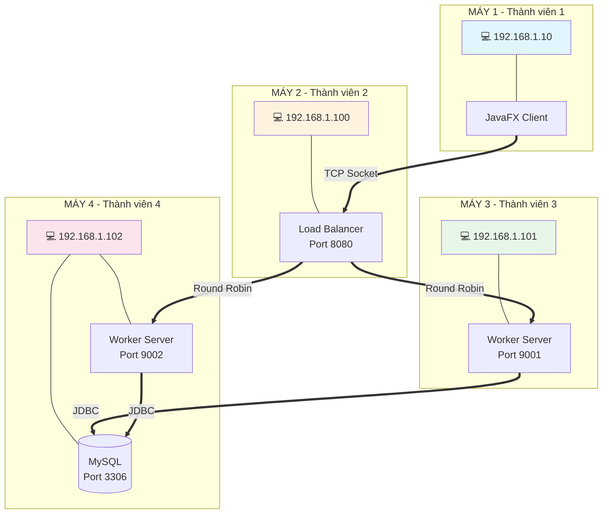

### 1.4.2 Cơ chế đồng bộ dữ liệu

> [!success]+ Giải pháp: Shared Database Pattern
> 
> Tất cả Worker Servers đều **kết nối đến cùng một MySQL Server** (Máy 4). Điều này đảm bảo:
> - **Consistency**: Mọi thay đổi đều được ghi vào cùng 1 database
> - **Real-time sync**: Worker 1 ghi → Worker 2 đọc được ngay lập tức
> - **No data duplication**: Không cần đồng bộ giữa các bản sao

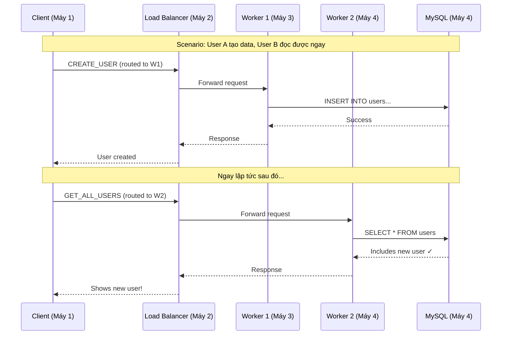

### 1.4.3 Cấu hình mạng cho 4 máy

> [!note]+ File `config.properties` trên MỖI máy

```properties
# ===== LOAD BALANCER (Máy 2) =====
LOAD_BALANCER_HOST=192.168.1.100
LOAD_BALANCER_PORT=8080

# ===== WORKER SERVERS =====
# Worker 1 (Máy 3)
WORKER1_HOST=192.168.1.101
WORKER1_PORT=9001

# Worker 2 (Máy 4) 
WORKER2_HOST=192.168.1.102
WORKER2_PORT=9002

# ===== DATABASE (Máy 4) =====
DB_URL=jdbc:mysql://192.168.1.102:3306/distributed_db
DB_USER=root
DB_PASSWORD=password
```

### 1.4.4 Phân công vai trò cho 4 thành viên

> [!tip]+ Mapping Server ↔ Thành viên

| Thành viên | Máy | IP (ví dụ) | Chạy component | Mô tả |
|------------|-----|------------|----------------|-------|
| **TV 1** | Máy 1 | 192.168.1.10 | JavaFX Client | Người dùng cuối, test hệ thống |
| **TV 2** | Máy 2 | 192.168.1.100 | Load Balancer | Gateway, điều phối requests |
| **TV 3** | Máy 3 | 192.168.1.101 | Worker Server 1 | Xử lý nghiệp vụ |
| **TV 4** | Máy 4 | 192.168.1.102 | Worker Server 2 + MySQL | Xử lý nghiệp vụ + Lưu trữ dữ liệu |

### 1.4.5 Quy trình khởi động hệ thống 4 máy

> [!warning]+ Thứ tự khởi động QUAN TRỌNG!

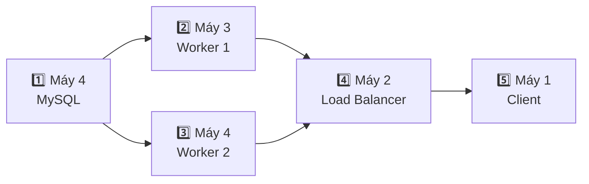

**Các bước:**

| Bước | Máy | Lệnh | Mô tả |
|------|-----|------|-------|
| 1 | Máy 4 | `docker-compose up -d` | Khởi động MySQL |
| 2 | Máy 3 | `.\gradlew.bat :server-node:runWorker1` | Khởi động Worker 1 |
| 3 | Máy 4 | `.\gradlew.bat :server-node:runWorker2` | Khởi động Worker 2 |
| 4 | Máy 2 | `.\gradlew.bat :load-balancer:run` | Khởi động Load Balancer |
| 5 | Máy 1 | `.\gradlew.bat :javafx-client:run` | Khởi động Client |

### 1.4.6 Mở Firewall trên mỗi máy

> [!bug]+ Lưu ý: Cần mở port trên Windows Firewall

**Máy 2 (Load Balancer):**
```powershell
netsh advfirewall firewall add rule name="LoadBalancer" dir=in action=allow protocol=tcp localport=8080
```

**Máy 3 (Worker 1):**
```powershell
netsh advfirewall firewall add rule name="Worker1" dir=in action=allow protocol=tcp localport=9001
```

**Máy 4 (Worker 2 + MySQL):**
```powershell
netsh advfirewall firewall add rule name="Worker2" dir=in action=allow protocol=tcp localport=9002
netsh advfirewall firewall add rule name="MySQL" dir=in action=allow protocol=tcp localport=3306
```

### 1.4.7 Kiểm tra kết nối giữa các máy

> [!example]+ Test connectivity

```powershell
# Từ Máy 1, ping các máy khác
ping 192.168.1.100  # Load Balancer
ping 192.168.1.101  # Worker 1
ping 192.168.1.102  # Worker 2 + DB

# Test port đang mở
Test-NetConnection -ComputerName 192.168.1.100 -Port 8080
Test-NetConnection -ComputerName 192.168.1.102 -Port 3306
```

---

# CHƯƠNG 2: CƠ SỞ LÝ THUYẾT

## 2.1 Hệ thống phân tán (Distributed Systems)

### 2.1.1 Định nghĩa

> [!quote]+ Định nghĩa
> **Hệ thống phân tán** là một tập hợp các máy tính độc lập xuất hiện đối với người dùng như một hệ thống nhất quán duy nhất.
> — Andrew S. Tanenbaum

### 2.1.2 Đặc điểm của hệ thống phân tán

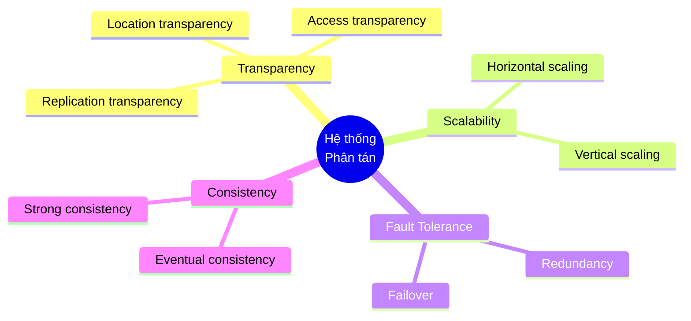

### 2.1.3 Định lý CAP

> [!warning]+ CAP Theorem
> Trong một hệ thống phân tán, chỉ có thể đảm bảo **tối đa 2 trong 3** thuộc tính sau:

| Thuộc tính | Mô tả |
|------------|-------|
| **C**onsistency | Mọi node đều thấy cùng dữ liệu tại cùng thời điểm |
| **A**vailability | Mọi request đều nhận được response (không lỗi) |
| **P**artition Tolerance | Hệ thống tiếp tục hoạt động dù có network partition |

**Lựa chọn trong dự án**: CP (Consistency + Partition Tolerance)
- Sử dụng MySQL single master → đảm bảo consistency
- Chấp nhận downtime nếu DB server fails

---

## 2.2 Mô hình Client-Server

### 2.2.1 Kiến trúc đa tầng (Multi-tier Architecture)

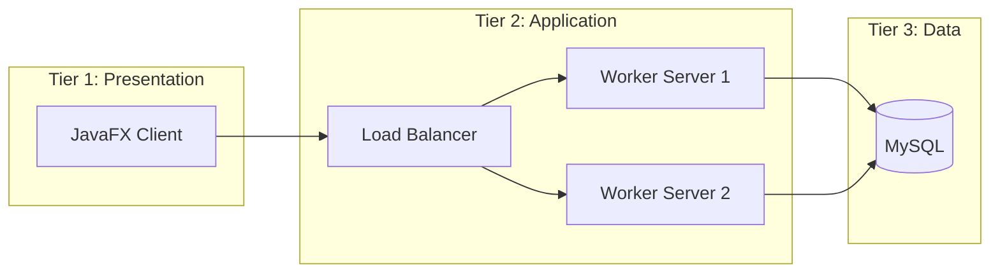

### 2.2.2 So sánh mô hình 2-tier và 3-tier

| Tiêu chí | 2-Tier | 3-Tier (Dự án này) |
|----------|--------|---------------------|
| Cấu trúc | Client ↔ Database | Client ↔ App Server ↔ Database |
| Scalability | Hạn chế | Cao (thêm Worker dễ dàng) |
| Security | DB exposed | DB được bảo vệ bởi App layer |
| Maintenance | Khó | Dễ (tách biệt concerns) |

---

## 2.3 Lập trình Socket TCP/IP

### 2.3.1 So sánh các giao thức giao tiếp

> [!tip]+ Bảng so sánh

| Đặc điểm | Java Sockets (TCP) | Java RMI | HTTP/REST |
|----------|-------------------|----------|-----------|
| **Mô hình** | Stream-based, mức thấp | Object-based, RPC | Document-based, mức cao |
| **Hiệu năng** | ⭐⭐⭐ Rất cao | ⭐⭐ Trung bình | ⭐ Thấp hơn |
| **Overhead** | Rất thấp | Trung bình (serialization) | Cao (HTTP headers) |
| **Kiểm soát** | Toàn diện | Che giấu chi tiết mạng | Stateless |
| **Độ phức tạp** | Cao (tự định nghĩa protocol) | Trung bình | Thấp |
| **Load Balancing** | Tự implement | Rất phức tạp | Có sẵn (Nginx, HAProxy) |

> [!success]+ Kết luận
> **Java Sockets (TCP)** được chọn vì:
> - Hiệu năng cao nhất, độ trễ thấp nhất
> - Kiểm soát toàn diện từng byte dữ liệu
> - Phù hợp cho ứng dụng Desktop real-time
> - Đáp ứng yêu cầu "không sử dụng Web"

### 2.3.2 Vấn đề TCP Stream và giải pháp

> [!bug]+ Vấn đề: TCP Fragmentation & Packet Coalescing
> 
> TCP là giao thức **stream-based**, không có khái niệm "message boundary":
> - **Fragmentation**: Một message lớn có thể bị chia thành nhiều packets
> - **Coalescing**: Nhiều messages nhỏ có thể được gộp thành một packet

**Ví dụ vấn đề:**
```
Gửi: [Message1][Message2][Message3]
Nhận: [Mess][age1Message2Mes][sage3]  ← Không biết đâu là ranh giới!
```

> [!success]+ Giải pháp: Length-Prefix Framing
> 
> Thêm **4 bytes header** chứa độ dài payload trước mỗi message:
> ```
> [4 bytes: length][N bytes: JSON payload]
> ```

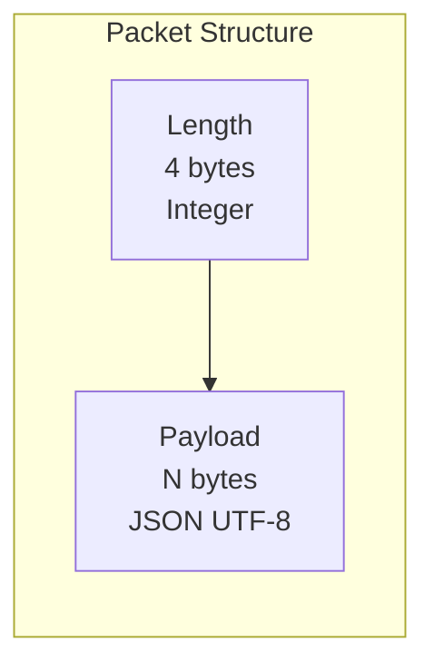

**Quy trình đọc:**
1. Đọc 4 bytes đầu tiên → biết được `length`
2. Đọc chính xác `length` bytes tiếp theo → có đầy đủ message
3. Deserialize JSON → xử lý

---

## 2.4 Cân bằng tải (Load Balancing)

### 2.4.1 Khái niệm

> [!info]+ Định nghĩa
> **Load Balancing** là kỹ thuật phân phối tải công việc (workload) đều đặn giữa nhiều máy chủ để tối ưu hóa việc sử dụng tài nguyên, tối đa hóa throughput, giảm thời gian phản hồi và tránh quá tải cho bất kỳ máy chủ đơn lẻ nào.

### 2.4.2 Các thuật toán cân bằng tải

| Thuật toán | Mô tả | Ưu điểm | Nhược điểm |
|------------|-------|---------|------------|
| **Round Robin** ✅ | Lần lượt từng server | Đơn giản, công bằng | Không xét tải hiện tại |
| Weighted Round Robin | RR có trọng số | Xét năng lực server | Phức tạp hơn |
| Least Connections | Chọn server ít conn nhất | Cân bằng thực sự | Cần tracking state |
| IP Hash | Hash IP client | Session persistence | Không đều nếu IP skewed |

> [!success]+ Lựa chọn: Round Robin
> - Đơn giản, dễ implement
> - Phù hợp với các Worker có cấu hình tương đương
> - Stateless → không cần lưu trạng thái

### 2.4.3 Thuật toán Round Robin

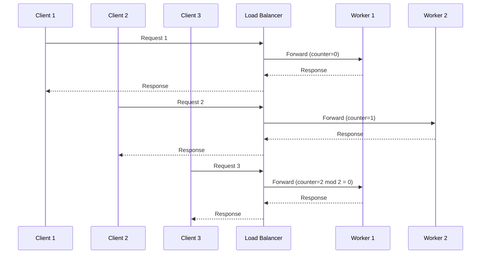

**Pseudocode:**
```java
AtomicInteger counter = new AtomicInteger(0);
String[] workers = {"192.168.1.101:9001", "192.168.1.102:9002"};

String getNextWorker() {
    int index = counter.getAndUpdate(i -> (i + 1) % workers.length);
    return workers[index];
}
```

---

## 2.5 Lập trình đa luồng (Multithreading)

### 2.5.1 Vấn đề Blocking I/O

> [!warning]+ Vấn đề
> Khi Server dùng single thread để xử lý requests:
> - Thread bị **block** khi chờ I/O (đọc socket, query DB)
> - Các client khác phải **chờ** → throughput thấp

### 2.5.2 Giải pháp: Thread Pool

> [!success]+ ExecutorService
> Java cung cấp `ExecutorService` để quản lý pool of threads:
> - **Fixed Thread Pool**: Số lượng thread cố định
> - **Cached Thread Pool**: Tự động scale theo nhu cầu
> - **Scheduled Thread Pool**: Cho các tác vụ định kỳ

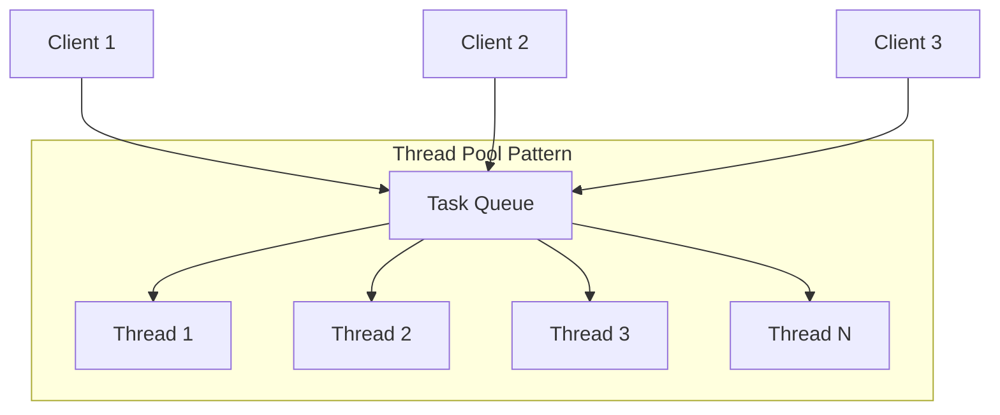

**Cấu hình trong dự án:**
- Load Balancer: **20 threads** (nhiều vì chỉ forward, không xử lý nặng)
- Worker Server: **10 threads** (ít hơn vì mỗi request tốn tài nguyên hơn)

### 2.5.3 Xử lý bất đồng bộ trong JavaFX

> [!bug]+ Vấn đề: Block UI Thread
> JavaFX có **Application Thread** duy nhất để render UI. Nếu thực hiện I/O trên thread này → UI bị **freeze**.

> [!success]+ Giải pháp: javafx.concurrent.Task
> Đẩy I/O operations xuống **background thread**, cập nhật UI qua `Platform.runLater()`.

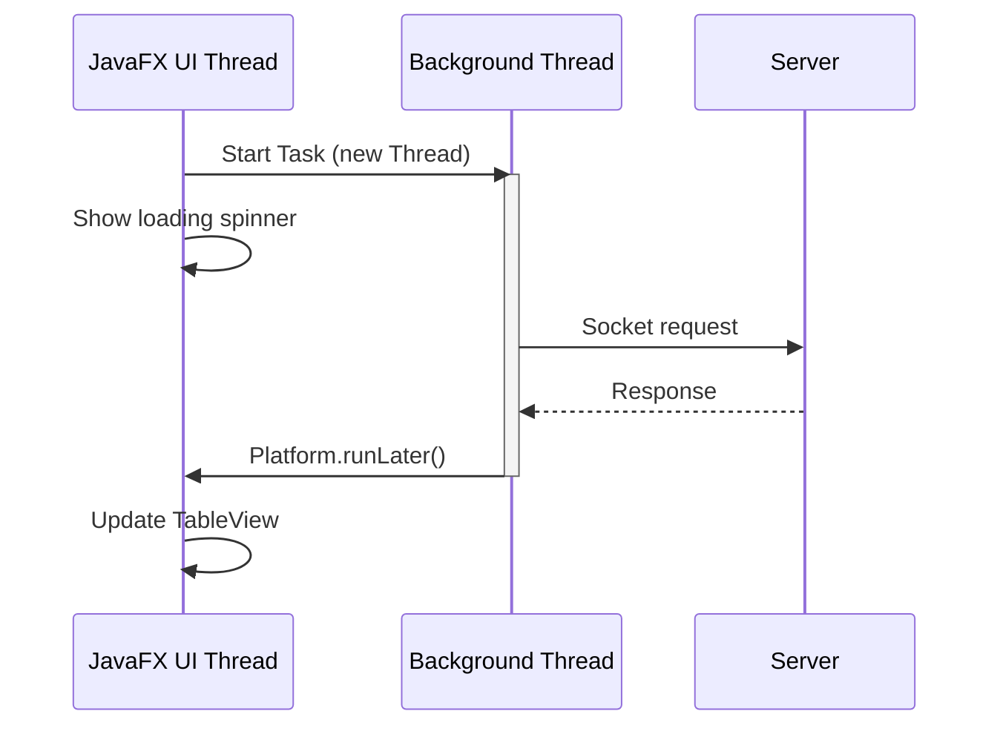

---

## 2.6 Connection Pooling

### 2.6.1 Vấn đề mở kết nối Database

> [!warning]+ Chi phí mở kết nối MySQL
> Mỗi lần `DriverManager.getConnection()`:
> 1. **TCP handshake** (3-way)
> 2. **MySQL authentication** (username/password)
> 3. **Session initialization**
> 4. **Character set negotiation**
> 
> → Tốn **50-200ms** mỗi lần!

### 2.6.2 Giải pháp: Connection Pool

> [!success]+ HikariCP
> Tạo sẵn một pool các connections, tái sử dụng thay vì tạo mới:

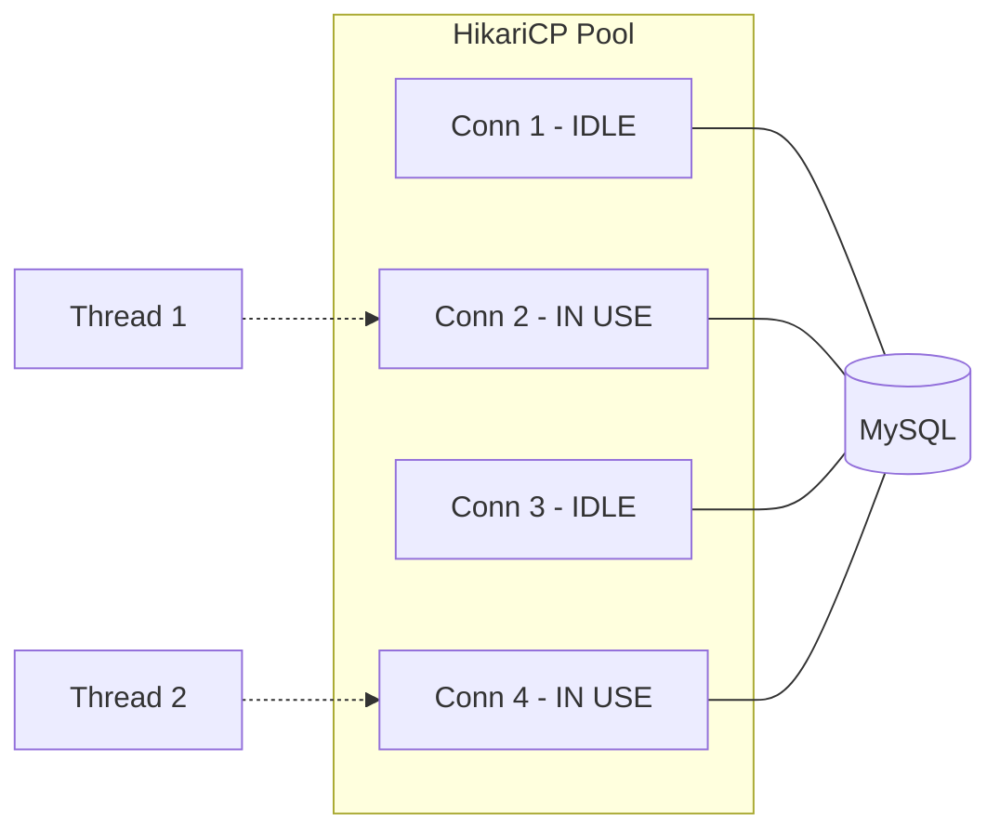

**Cấu hình HikariCP trong dự án:**
```java
config.setMaximumPoolSize(10);    // Tối đa 10 connections
config.setMinimumIdle(2);         // Luôn giữ 2 connections sẵn
config.setIdleTimeout(30000);     // Đóng idle conn sau 30s
config.setConnectionTimeout(10000); // Timeout lấy conn: 10s
```

---

## 2.7 Serialization: JSON với Jackson

### 2.7.1 So sánh các phương pháp Serialization

| Phương pháp | Kích thước | CPU Cost | Đọc được | Linh hoạt |
|-------------|------------|----------|----------|-----------|
| **JSON** ✅ | Trung bình | Trung bình | ✅ Có | ✅ Cao |
| Java Serialization | Lớn | Cao | ❌ Không | ❌ Thấp |
| Protobuf | Nhỏ nhất | Thấp | ❌ Không | Trung bình |
| XML | Rất lớn | Cao | ✅ Có | ✅ Cao |

> [!success]+ Lựa chọn: JSON với Jackson
> - **Đọc được**: Debug dễ dàng (xem payload trực tiếp)
> - **Linh hoạt**: Schema-less, dễ thêm/bớt fields
> - **Hiệu năng tốt**: Jackson là thư viện JSON nhanh nhất cho Java
> - **Standard**: Được sử dụng rộng rãi, tài liệu phong phú

### 2.7.2 Cấu trúc Payload

**Request Payload:**
```json
{
  "command": "GET_USER",
  "data": "123",
  "requestId": "a1b2c3d4",
  "timestamp": 1708419200000
}
```

**Response Payload:**
```json
{
  "status": "SUCCESS",
  "data": "{\"id\":123,\"username\":\"john\"}",
  "message": "User found",
  "requestId": "a1b2c3d4",
  "workerId": "Worker-9001",
  "processingTimeMs": 15,
  "users": null
}
```

---

# CHƯƠNG 3: THIẾT KẾ VÀ TRIỂN KHAI

## 3.1 Thiết kế Cơ sở dữ liệu

### 3.1.1 ERD (Entity Relationship Diagram)

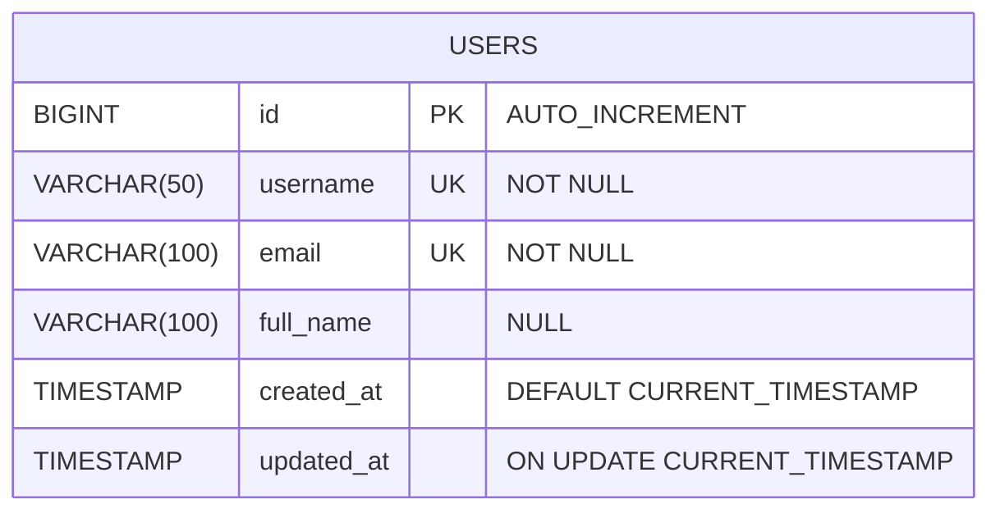

### 3.1.2 Script tạo bảng

```sql
CREATE TABLE IF NOT EXISTS users (
    id BIGINT PRIMARY KEY AUTO_INCREMENT,
    username VARCHAR(50) NOT NULL UNIQUE,
    email VARCHAR(100) NOT NULL UNIQUE,
    full_name VARCHAR(100),
    created_at TIMESTAMP DEFAULT CURRENT_TIMESTAMP,
    updated_at TIMESTAMP DEFAULT CURRENT_TIMESTAMP ON UPDATE CURRENT_TIMESTAMP,
    INDEX idx_username (username),
    INDEX idx_email (email)
) ENGINE=InnoDB;
```

### 3.1.3 Indexes

| Index Name | Column(s) | Mục đích |
|------------|-----------|----------|
| PRIMARY | id | Truy vấn theo ID |
| idx_username | username | Tìm kiếm theo username |
| idx_email | email | Tìm kiếm theo email |

---

## 3.2 Sơ đồ phân cấp chức năng

### 3.2.1 Chức năng tổng quan

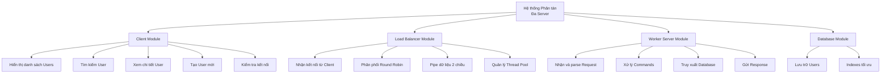

### 3.2.2 Chi tiết Commands

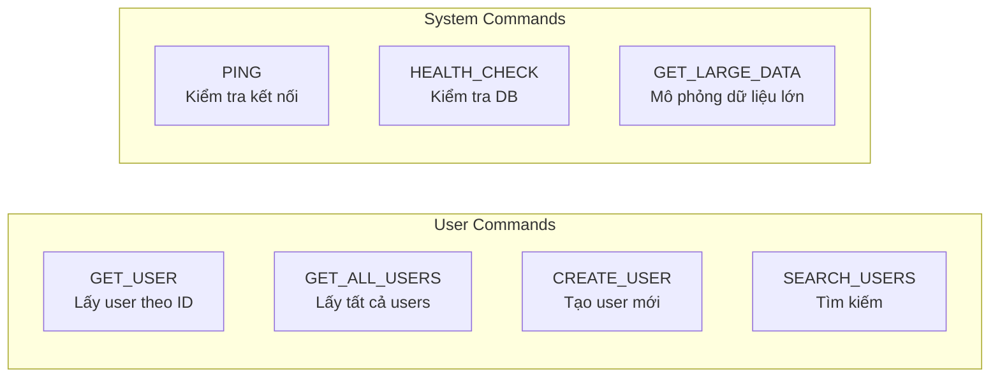

---

## 3.3 Sơ đồ hoạt động (Sequence Diagrams)

### 3.3.1 Luồng xử lý Request chính

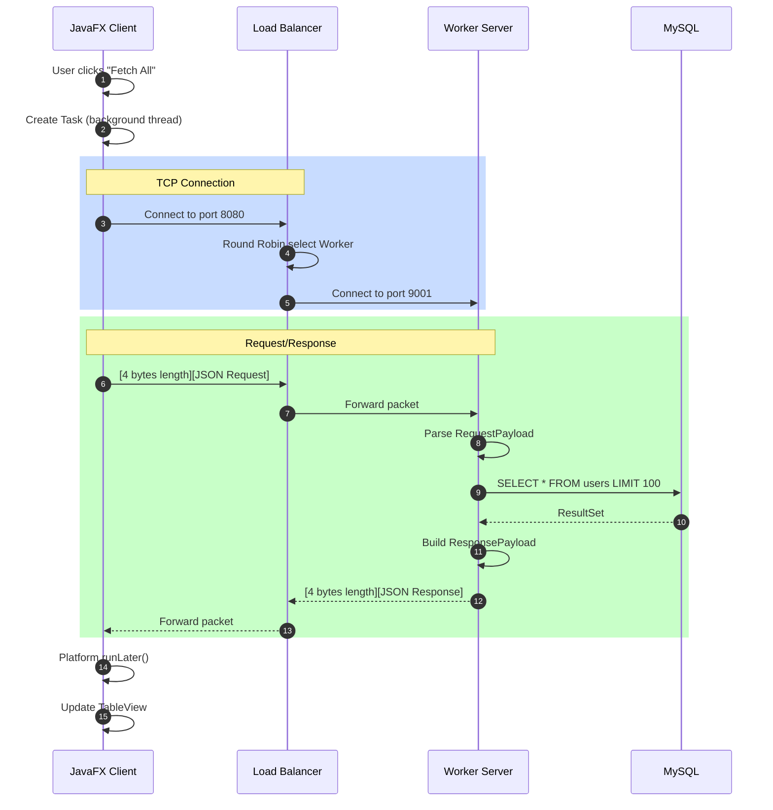

### 3.3.2 Luồng Load Balancer chi tiết

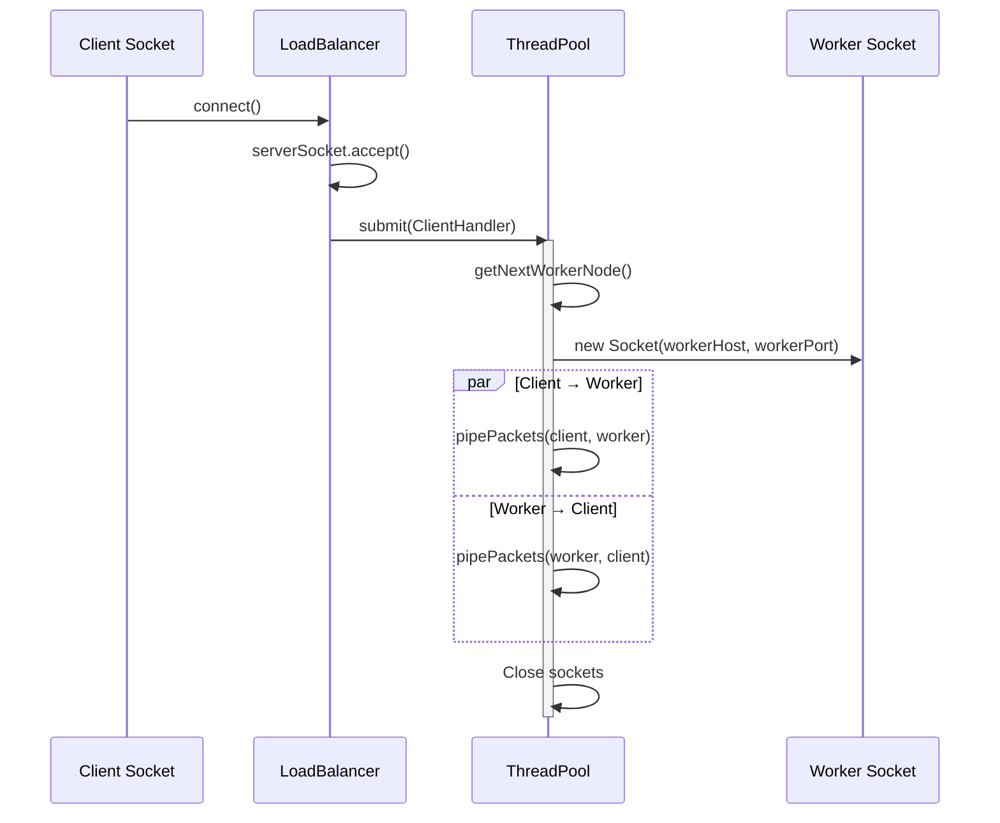

---

## 3.4 Triển khai Code chi tiết

### 3.4.1 Module: common-lib

> [!example]+ PacketUtils.java - Length-Prefix Framing

```java
/**
 * Utility class for sending and receiving packets 
 * using Length-Prefix Framing protocol.
 *
 * Packet structure:
 * [4 bytes Integer (length)] + [JSON Payload String (UTF-8 encoded)]
 */
public class PacketUtils {
    private static final ObjectMapper objectMapper = new ObjectMapper();
    private static final int MAX_PACKET_SIZE = 10 * 1024 * 1024; // 10 MB

    /**
     * Sends an object as a JSON packet using Length-Prefix Framing.
     */
    public static void sendPacket(Socket socket, Object payload) throws IOException {
        DataOutputStream outputStream = new DataOutputStream(socket.getOutputStream());
        String json = objectMapper.writeValueAsString(payload);
        byte[] data = json.getBytes(StandardCharsets.UTF_8);

        synchronized (outputStream) {
            outputStream.writeInt(data.length);  // 4 bytes header
            outputStream.write(data);            // N bytes payload
            outputStream.flush();
        }
    }

    /**
     * Receives a JSON packet and deserializes it.
     */
    public static <T> T receivePacket(Socket socket, Class<T> clazz) throws IOException {
        DataInputStream inputStream = new DataInputStream(socket.getInputStream());

        int length = inputStream.readInt();  // Read 4 bytes header

        // Validate packet size
        if (length < 0 || length > MAX_PACKET_SIZE) {
            throw new IOException("Invalid packet size: " + length);
        }

        byte[] data = new byte[length];
        inputStream.readFully(data);  // Read exactly N bytes
        String json = new String(data, StandardCharsets.UTF_8);
        return objectMapper.readValue(json, clazz);
    }
}
```

> [!example]+ RequestPayload.java - DTO với Lombok

```java
@Data
@NoArgsConstructor
@AllArgsConstructor
@Builder
@JsonIgnoreProperties(ignoreUnknown = true)
public class RequestPayload {
    private String command;      // e.g., "GET_USER"
    private String data;         // e.g., "123" (user ID)
    private String requestId;    // UUID for tracking
    
    @Builder.Default
    private long timestamp = System.currentTimeMillis();
}
```

### 3.4.2 Module: load-balancer

> [!example]+ LoadBalancer.java - Round Robin

```java
public class LoadBalancer {
    private static final int THREAD_POOL_SIZE = 20;
    
    private final int port;
    private final List<String> workerNodes;
    private final AtomicInteger roundRobinCounter = new AtomicInteger(0);
    private final ExecutorService threadPool;

    public LoadBalancer() {
        this.port = NetworkConfig.getLoadBalancerPort();  // 8080
        this.workerNodes = Arrays.asList(NetworkConfig.getWorkerNodes());
        this.threadPool = Executors.newFixedThreadPool(THREAD_POOL_SIZE);
    }

    public void start() {
        try (ServerSocket serverSocket = new ServerSocket(port)) {
            while (running) {
                Socket clientSocket = serverSocket.accept();
                // Submit to thread pool instead of creating new thread
                threadPool.submit(() -> handleClient(clientSocket));
            }
        }
    }

    /**
     * Round Robin algorithm implementation.
     */
    private String getNextWorkerNode() {
        int index = roundRobinCounter.getAndUpdate(i -> (i + 1) % workerNodes.size());
        return workerNodes.get(index);  // "localhost:9001" or "localhost:9002"
    }

    /**
     * Pipes packets bidirectionally between client and worker.
     */
    private void handleClient(Socket clientSocket) {
        String workerAddress = getNextWorkerNode();
        String[] parts = workerAddress.split(":");
        
        try (Socket workerSocket = new Socket(parts[0], Integer.parseInt(parts[1]))) {
            // Create bidirectional pipe
            Thread c2w = new Thread(() -> pipePackets(clientSocket, workerSocket));
            Thread w2c = new Thread(() -> pipePackets(workerSocket, clientSocket));
            
            c2w.start();
            w2c.start();
            
            c2w.join();
            w2c.join();
        }
    }
}
```

### 3.4.3 Module: server-node

> [!example]+ WorkerServer.java - Server chính

```java
public class WorkerServer {
    private static final int THREAD_POOL_SIZE = 10;
    
    private final int port;
    private final String workerId;
    private final ExecutorService threadPool;

    public WorkerServer(int port) {
        this.port = port;
        this.workerId = "Worker-" + port;
        this.threadPool = Executors.newFixedThreadPool(THREAD_POOL_SIZE);
    }

    public void start() {
        try (ServerSocket serverSocket = new ServerSocket(port)) {
            System.out.println(workerId + " started on port " + port);
            
            while (running) {
                Socket clientSocket = serverSocket.accept();
                threadPool.submit(new ClientHandler(clientSocket, workerId));
            }
        }
    }
}
```

> [!example]+ ClientHandler.java - Xử lý Commands

```java
public class ClientHandler implements Runnable {
    private final Socket clientSocket;
    private final String workerId;

    @Override
    public void run() {
        try {
            // Receive request using Length-Prefix Framing
            RequestPayload request = PacketUtils.receivePacket(
                clientSocket, RequestPayload.class);
            
            // Process command
            ResponsePayload response = handleRequest(request);
            response.setWorkerId(workerId);
            
            // Send response
            PacketUtils.sendPacket(clientSocket, response);
        } finally {
            clientSocket.close();
        }
    }

    private ResponsePayload handleRequest(RequestPayload request) {
        switch (request.getCommand()) {
            case Commands.GET_USER:
                return queryUser(request.getData());
            case Commands.GET_ALL_USERS:
                return getAllUsers();
            case Commands.CREATE_USER:
                return createUser(request.getData());
            case Commands.SEARCH_USERS:
                return searchUsers(request.getData());
            case Commands.PING:
                return ResponsePayload.success("PONG", "Server is alive");
            case Commands.HEALTH_CHECK:
                return healthCheck();
            default:
                return ResponsePayload.error("Unknown command");
        }
    }
}
```

> [!example]+ DatabaseConnection.java - HikariCP Pool

```java
public class DatabaseConnection {
    private static final HikariDataSource dataSource;

    static {
        HikariConfig config = new HikariConfig();
        config.setJdbcUrl(NetworkConfig.getDbUrl());
        config.setUsername(NetworkConfig.getDbUser());
        config.setPassword(NetworkConfig.getDbPassword());

        // Connection pool settings
        config.setMaximumPoolSize(10);
        config.setMinimumIdle(2);
        config.setIdleTimeout(30000);
        config.setConnectionTimeout(10000);

        // MySQL optimizations
        config.addDataSourceProperty("cachePrepStmts", "true");
        config.addDataSourceProperty("prepStmtCacheSize", "250");
        config.addDataSourceProperty("useServerPrepStmts", "true");

        dataSource = new HikariDataSource(config);
    }

    public static DataSource getDataSource() {
        return dataSource;
    }
}
```

### 3.4.4 Module: javafx-client

> [!example]+ SocketClient.java - Singleton Client

```java
public class SocketClient {
    private static volatile SocketClient instance;
    
    private final String loadBalancerHost;
    private final int loadBalancerPort;

    private SocketClient() {
        this.loadBalancerHost = NetworkConfig.getLoadBalancerHost();
        this.loadBalancerPort = NetworkConfig.getLoadBalancerPort();
    }

    public static SocketClient getInstance() {
        if (instance == null) {
            synchronized (SocketClient.class) {
                if (instance == null) {
                    instance = new SocketClient();
                }
            }
        }
        return instance;
    }

    /**
     * Sends request and receives response.
     * Creates new connection per request (stateless pattern).
     */
    public ResponsePayload sendRequest(RequestPayload request) throws IOException {
        try (Socket socket = new Socket(loadBalancerHost, loadBalancerPort)) {
            socket.setSoTimeout(60000);  // 60s timeout
            
            PacketUtils.sendPacket(socket, request);
            return PacketUtils.receivePacket(socket, ResponsePayload.class);
        }
    }
}
```

> [!example]+ ClientController.java - Async UI

```java
public class ClientController {
    @FXML private TableView<UserDTO> userTable;
    @FXML private ProgressIndicator progressIndicator;
    
    private final SocketClient socketClient = SocketClient.getInstance();

    /**
     * Fetches all users asynchronously.
     * IMPORTANT: Must NOT block JavaFX Application Thread!
     */
    private void fetchAllUsers() {
        Task<ResponsePayload> task = new Task<>() {
            @Override
            protected ResponsePayload call() throws IOException {
                // This runs on BACKGROUND THREAD
                RequestPayload request = new RequestPayload(
                    Commands.GET_ALL_USERS, null);
                return socketClient.sendRequest(request);
            }
        };

        task.setOnSucceeded(e -> {
            // This runs on JAVAFX THREAD (safe to update UI)
            ResponsePayload response = task.getValue();
            if (response.isSuccess()) {
                userData.setAll(response.getUsers());
            }
            progressIndicator.setVisible(false);
        });

        task.setOnFailed(e -> {
            showAlert("Error: " + task.getException().getMessage());
            progressIndicator.setVisible(false);
        });

        progressIndicator.setVisible(true);
        new Thread(task).start();  // Start background thread
    }
}
```

---

## 3.5 Sơ đồ triển khai (Deployment Diagram)

### 3.5.1 Triển khai trên 1 máy (Development)

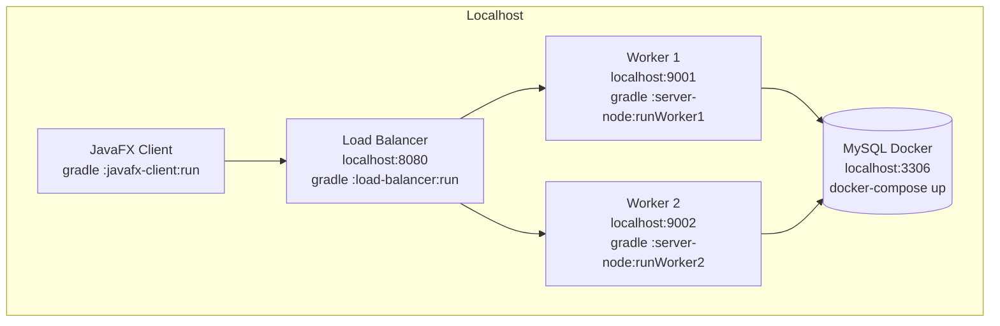

### 3.5.2 Triển khai trên 4 máy (Production)

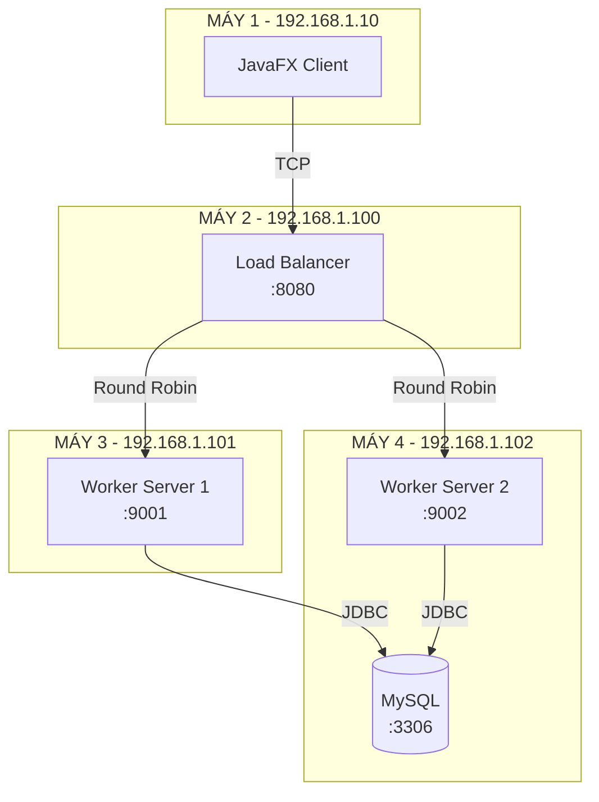

---

# CHƯƠNG 4: NGHIỆM THU VÀ KIỂM THỬ

## 4.1 Môi trường kiểm thử

> [!info]+ Cấu hình máy test

| Thông số | Giá trị |
|----------|---------|
| OS | Windows 11 |
| CPU | Intel Core i7 / AMD Ryzen 7 |
| RAM | 16 GB |
| Java | OpenJDK 21 |
| MySQL | 8.0 (Docker) |

## 4.2 Hướng dẫn chạy hệ thống

### 4.2.1 Bước 1: Khởi động Database

```powershell
# Khởi động MySQL + phpMyAdmin
docker-compose up -d

# Kiểm tra container
docker ps

# Xem logs
docker-compose logs -f mysql
```

> [!tip]+ Truy cập
> - MySQL: `localhost:3306` (user: root, pass: password)
> - phpMyAdmin: http://localhost:8081

### 4.2.2 Bước 2: Build Project

```powershell
.\gradlew.bat build
```

### 4.2.3 Bước 3: Khởi động theo thứ tự

> [!warning]+ Thứ tự quan trọng!
> Phải khởi động theo đúng thứ tự: DB → Workers → Load Balancer → Client

**Terminal 1 - Worker Server 1:**
```powershell
.\gradlew.bat :server-node:runWorker1
```

**Terminal 2 - Worker Server 2:**
```powershell
.\gradlew.bat :server-node:runWorker2
```

**Terminal 3 - Load Balancer:**
```powershell
.\gradlew.bat :load-balancer:run
```

**Terminal 4 - JavaFX Client:**
```powershell
.\gradlew.bat :javafx-client:run
```

## 4.3 Kịch bản kiểm thử

### 4.3.1 Test Case 1: Kết nối cơ bản

| Bước | Thao tác | Kết quả mong đợi |
|------|----------|------------------|
| 1 | Mở Client | UI hiển thị "Ready" |
| 2 | Click "Ping" | Hiển thị "PONG! Server is alive" |
| 3 | Quan sát Worker | Hiển thị "Worker-9001" hoặc "Worker-9002" |

### 4.3.2 Test Case 2: Load Balancing

| Bước | Thao tác | Kết quả mong đợi |
|------|----------|------------------|
| 1 | Click "Ping" lần 1 | Worker-9001 |
| 2 | Click "Ping" lần 2 | Worker-9002 |
| 3 | Click "Ping" lần 3 | Worker-9001 |
| 4 | Click "Ping" lần 4 | Worker-9002 |

> [!success]+ Kết quả
> Requests được phân phối đều theo Round Robin

### 4.3.3 Test Case 3: CRUD Operations

| Test | Command | Input | Expected |
|------|---------|-------|----------|
| Fetch All | GET_ALL_USERS | - | 100 users trong TableView |
| Get by ID | GET_USER | "1" | User "john_doe" |
| Search | SEARCH_USERS | "john" | Các user chứa "john" |
| Create | CREATE_USER | JSON | "User created successfully" |

### 4.3.4 Test Case 4: Multi-Client

> [!example]+ Mở nhiều Client cùng lúc

```powershell
# Terminal 5
.\gradlew.bat :javafx-client:run

# Terminal 6
.\gradlew.bat :javafx-client:run

# Terminal 7
.\gradlew.bat :javafx-client:run
```

**Quan sát Load Balancer console:**
```
[LB] Connection #1 from /127.0.0.1:54321 | Active: 1
[LB] Routing connection #1 to localhost:9001
[LB] Connection #2 from /127.0.0.1:54322 | Active: 2
[LB] Routing connection #2 to localhost:9002
[LB] Connection #3 from /127.0.0.1:54323 | Active: 3
[LB] Routing connection #3 to localhost:9001
```

## 4.4 Screenshots Demo

> [!note]+ Placeholder cho screenshots
> *Thêm screenshots thực tế khi demo*

### 4.4.1 Giao diện Client

```
┌─────────────────────────────────────────────────────────────┐
│  Distributed System Client                              [_][□][X]
├─────────────────────────────────────────────────────────────┤
│  [Fetch All]  [Search: ________]  [User ID: ___]  [Ping]   │
├─────────────────────────────────────────────────────────────┤
│  ID │ Username      │ Email                │ Full Name     │
│─────┼───────────────┼──────────────────────┼───────────────│
│  1  │ john_doe      │ john.doe@email.com   │ John Doe      │
│  2  │ jane_smith    │ jane.smith@email.com │ Jane Smith    │
│  3  │ bob_wilson    │ bob.wilson@email.com │ Bob Wilson    │
│ ... │ ...           │ ...                  │ ...           │
├─────────────────────────────────────────────────────────────┤
│  Status: Loaded 100 users │ Worker: Worker-9001 │ Time: 15ms│
└─────────────────────────────────────────────────────────────┘
```

### 4.4.2 Console Load Balancer

```
╔══════════════════════════════════════════╗
║         LOAD BALANCER STARTED            ║
╠══════════════════════════════════════════╣
║  Port: 8080                              ║
║  Algorithm: Round Robin                  ║
║  Thread Pool: 20                         ║
╠══════════════════════════════════════════╣
║  Worker Nodes:                           ║
║    - localhost:9001                      ║
║    - localhost:9002                      ║
╚══════════════════════════════════════════╝
```

### 4.4.3 Console Worker Server

```
========================================
  Worker-9001 started on port 9001
  Thread Pool Size: 10
  Database: jdbc:mysql://localhost:3306/distributed_db (user: root)
========================================
[Worker-9001] Connection #1 from /127.0.0.1:54000
[Worker-9001] Received: GET_ALL_USERS | Data: null
[Worker-9001] Response sent in 12ms
```

## 4.5 Đánh giá hiệu năng

### 4.5.1 Response Time

| Operation | Avg Time | Max Time |
|-----------|----------|----------|
| PING | 2-5 ms | 10 ms |
| GET_USER | 10-20 ms | 50 ms |
| GET_ALL_USERS (100 records) | 15-30 ms | 100 ms |
| SEARCH_USERS | 20-40 ms | 80 ms |
| GET_LARGE_DATA (simulated) | 100-150 ms | 200 ms |

### 4.5.2 Throughput

| Metric | Value |
|--------|-------|
| Max concurrent clients | 20 (limited by LB thread pool) |
| Requests/second (simple PING) | ~500 |
| DB connections pool | 10 per Worker |

---

# CHƯƠNG 5: KẾT LUẬN VÀ HƯỚNG PHÁT TRIỂN

## 5.1 Kết quả đạt được

> [!success]+ Hoàn thành các yêu cầu

| Yêu cầu | Trạng thái | Ghi chú |
|---------|------------|---------|
| 4 Server | ✅ | 1 LB + 2 Worker + 1 DB |
| Cân bằng tải | ✅ | Round Robin algorithm |
| Đồng bộ dữ liệu | ✅ | Shared Database Pattern |
| Client Desktop | ✅ | JavaFX với async operations |
| Ngôn ngữ Java | ✅ | Java 21 + JavaFX 21 |
| Không dùng Web | ✅ | TCP Socket thuần túy |

## 5.2 Ưu điểm của hệ thống

> [!tip]+ Điểm mạnh

1. **Hiệu năng cao**: TCP Socket không có overhead của HTTP
2. **Độ trễ thấp**: Direct connection, length-prefix framing
3. **Scalable**: Dễ dàng thêm Worker nodes
4. **Modular**: Gradle multi-module, tách biệt concerns
5. **Production-ready**: HikariCP, Thread Pool, proper error handling

## 5.3 Hạn chế

> [!warning]+ Cần cải thiện

1. **Single Point of Failure**: Load Balancer là SPOF
2. **No SSL/TLS**: Dữ liệu truyền clear text
3. **No Active Health Check**: Chỉ có passive detection
4. **Single DB**: Chưa có replication thực sự

## 5.4 Hướng phát triển

> [!quote]+ Roadmap

### Đã hoàn thành ✅
- [x] Implement UPDATE_USER và DELETE_USER commands
- [x] Implement GET_STATS command
- [x] Remote MySQL access từ các máy khác trong LAN
- [x] Hướng dẫn cài đặt chi tiết cho 4 máy (SETUP-GUIDE.md)
- [x] **UI buttons cho Create/Update/Delete** trên JavaFX
- [x] **Active Health Check** cho Load Balancer (mỗi 10s)
- [x] **SSL/TLS encryption** cho Socket (optional, configurable)

### Có thể mở rộng
- [ ] Load Balancer redundancy (2 LB với heartbeat)
- [ ] MySQL Master-Slave Replication
- [ ] Caching layer (Redis)

### Dài hạn
- [ ] Database Sharding thực sự
- [ ] Kubernetes deployment
- [ ] Monitoring với Prometheus/Grafana

---

# PHỤ LỤC

## A. Hướng dẫn cài đặt chi tiết

### A.1 Yêu cầu hệ thống

- JDK 17 hoặc cao hơn
- Docker Desktop (cho MySQL)
- Git (để clone source)

### A.2 Clone và Build

```powershell
# Clone repository
git clone <repository-url>
cd distributed-system-root

# Build
.\gradlew.bat build
```

### A.3 Cấu hình Multi-Machine

Tạo file `config.properties`:

```properties
# Load Balancer (Máy 2)
LOAD_BALANCER_HOST=192.168.1.100
LOAD_BALANCER_PORT=8080

# Worker 1 (Máy 3)
WORKER1_HOST=192.168.1.101
WORKER1_PORT=9001

# Worker 2 (Máy 4)
WORKER2_HOST=192.168.1.102
WORKER2_PORT=9002

# Database
DB_URL=jdbc:mysql://192.168.1.102:3306/distributed_db
DB_USER=root
DB_PASSWORD=password
```

### A.4 Mở Firewall

```powershell
# Load Balancer machine
netsh advfirewall firewall add rule name="LB" dir=in action=allow protocol=tcp localport=8080

# Worker 1 machine
netsh advfirewall firewall add rule name="Worker1" dir=in action=allow protocol=tcp localport=9001

# Worker 2 machine
netsh advfirewall firewall add rule name="Worker2" dir=in action=allow protocol=tcp localport=9002

# MySQL machine
netsh advfirewall firewall add rule name="MySQL" dir=in action=allow protocol=tcp localport=3306
```

---

## B. Danh sách Commands

| Command | Parameters | Response |
|---------|------------|----------|
| `GET_USER` | User ID (string) | UserDTO JSON |
| `GET_ALL_USERS` | None | List of UserDTO |
| `CREATE_USER` | UserDTO JSON | Success/Error message |
| `UPDATE_USER` | UserDTO JSON (với id) | Success/Error message |
| `DELETE_USER` | User ID (string) | Success/Error message |
| `SEARCH_USERS` | Keyword | List of UserDTO |
| `PING` | None | "PONG" |
| `HEALTH_CHECK` | None | DB status |
| `GET_STATS` | None | Server statistics JSON |
| `GET_LARGE_DATA` | None | Simulated large response |

---

## C. Tài liệu tham khảo

1. Tanenbaum, A. S., & Van Steen, M. (2017). *Distributed Systems: Principles and Paradigms*
2. Oracle. *Java SE Documentation* - https://docs.oracle.com/en/java/
3. OpenJFX. *JavaFX Documentation* - https://openjfx.io/
4. HikariCP. *Fast, simple, reliable* - https://github.com/brettwooldridge/HikariCP
5. MySQL. *Reference Manual 8.0* - https://dev.mysql.com/doc/refman/8.0/en/

---

## D. Phân công công việc nhóm

| Thành viên | Vai trò | Module phụ trách |
|------------|---------|------------------|
| Thành viên 1 | Network Architect | Load Balancer, Protocol |
| Thành viên 2 | Backend Engineer | Worker Server, Database |
| Thành viên 3 | Frontend Engineer | JavaFX Client |
| Thành viên 4 | DevOps | Docker, Deployment, Testing |

---

*Báo cáo được tạo: 2026-02-20*

---

## 🔗 Links

- [[TODO-ANALYSIS]] - Phân tích tình trạng dự án
- [[README]] - Hướng dẫn nhanh

---

#distributed-system #java #socket #javafx #report
