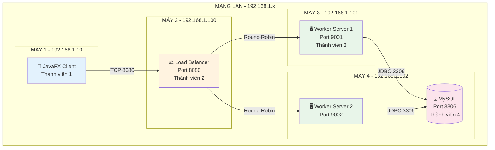
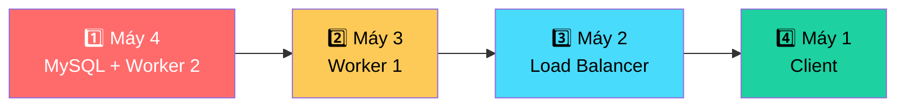

---
tags:
  - setup
  - installation
  - network
  - distributed-system
aliases:
  - Hướng dẫn cài đặt
  - Setup Guide
created: 2026-02-21
updated: 2026-02-21
cssclasses:
  - setup-guide
  - colorful-admonitions
---

# 🛠️ HƯỚNG DẪN CÀI ĐẶT HỆ THỐNG PHÂN TÁN 4 MÁY

> [!abstract]+ 📌 Tổng quan
> Hướng dẫn này giúp 4 thành viên trong nhóm cài đặt và kết nối hệ thống phân tán trên 4 máy tính khác nhau trong cùng mạng LAN.

---

# 📋 CẤU HÌNH IP CHUẨN HÓA

> [!warning]+ ⚠️ QUAN TRỌNG - ĐỌC TRƯỚC KHI CÀI ĐẶT
> 
> **Chỉ cần thay đổi IP ở bảng dưới đây, tất cả các hướng dẫn bên dưới đều sử dụng các biến này.**
> 
> Mỗi thành viên cần kiểm tra IP máy mình bằng lệnh `ipconfig` rồi điền vào bảng.

## 🔧 BẢNG CẤU HÌNH IP (SỬA Ở ĐÂY)

```properties
# ╔══════════════════════════════════════════════════════════════╗
# ║           CẤU HÌNH IP - SỬA TẠI ĐÂY                         ║
# ╠══════════════════════════════════════════════════════════════╣
# ║  Thay đổi các IP dưới đây cho phù hợp với mạng của nhóm     ║
# ╚══════════════════════════════════════════════════════════════╝

# Máy 1 - Client (Thành viên 1)
CLIENT_IP=192.168.1.10

# Máy 2 - Load Balancer (Thành viên 2)
LOAD_BALANCER_IP=192.168.1.100
LOAD_BALANCER_PORT=8080

# Máy 3 - Worker Server 1 (Thành viên 3)
WORKER1_IP=192.168.1.101
WORKER1_PORT=9001

# Máy 4 - Worker Server 2 + Database (Thành viên 4)
WORKER2_IP=192.168.1.102
WORKER2_PORT=9002
DB_PORT=3306

# Database credentials
DB_NAME=distributed_db
DB_USER=root
DB_PASSWORD=password
```

## 📊 Sơ đồ kết nối



---

# 📝 YÊU CẦU CHUNG CHO TẤT CẢ MÁY

> [!info]+ Yêu cầu phần mềm

| Phần mềm | Version | Ghi chú |
|----------|---------|---------|
| **JDK** | 21+ | OpenJDK hoặc Oracle JDK |
| **Git** | Latest | Để clone source code |
| **Docker** | Latest | Chỉ cần trên Máy 4 (Database) |

## Bước 0: Kiểm tra IP của máy mình

```powershell
# Mở PowerShell và chạy:
ipconfig

# Tìm dòng "IPv4 Address" trong phần "Wireless LAN adapter Wi-Fi" 
# hoặc "Ethernet adapter"
# Ví dụ: IPv4 Address. . . . . . . . . . . : 192.168.1.101
```

## Bước 1: Clone source code (TẤT CẢ MÁY)

```powershell
# Clone repository
git clone <repository-url> distributed-system
cd distributed-system

# Hoặc copy folder từ USB/shared drive
```

## Bước 2: Tạo file config.properties (TẤT CẢ MÁY)

> [!warning]+ File này PHẢI giống nhau trên TẤT CẢ 4 MÁY

Tạo file `config.properties` trong thư mục gốc của project:

```powershell
# Tạo file config.properties
New-Item -Path "config.properties" -ItemType File
```

**Nội dung file `config.properties`:**

```properties
# ╔══════════════════════════════════════════════════════════════╗
# ║  CONFIG.PROPERTIES - COPY FILE NÀY VÀO TẤT CẢ 4 MÁY        ║
# ╠══════════════════════════════════════════════════════════════╣
# ║  Thay đổi IP cho phù hợp với mạng của nhóm bạn              ║
# ╚══════════════════════════════════════════════════════════════╝

# ============== LOAD BALANCER (Máy 2) ==============
LOAD_BALANCER_HOST=192.168.1.100
LOAD_BALANCER_PORT=8080

# ============== WORKER SERVERS ==============
# Worker 1 (Máy 3)
WORKER1_HOST=192.168.1.101
WORKER1_PORT=9001

# Worker 2 (Máy 4)
WORKER2_HOST=192.168.1.102
WORKER2_PORT=9002

# ============== DATABASE (Máy 4) ==============
DB_URL=jdbc:mysql://192.168.1.102:3306/distributed_db
DB_USER=root
DB_PASSWORD=password
```

---

# 🖥️ HƯỚNG DẪN CHO TỪNG MÁY

---

## 💻 MÁY 4 - DATABASE + WORKER 2 (Thành viên 4)

> [!danger]+ ⚠️ MÁY NÀY PHẢI KHỞI ĐỘNG ĐẦU TIÊN!

### Bước 1: Cài Docker Desktop

1. Tải Docker Desktop: https://www.docker.com/products/docker-desktop
2. Cài đặt và khởi động lại máy
3. Mở Docker Desktop và đợi nó chạy

### Bước 2: Mở Firewall cho MySQL và Worker 2

```powershell
# Chạy PowerShell với quyền Administrator
# Click phải vào PowerShell -> Run as Administrator

# Mở port MySQL 3306
netsh advfirewall firewall add rule name="MySQL-3306" dir=in action=allow protocol=tcp localport=3306

# Mở port Worker 2
netsh advfirewall firewall add rule name="Worker2-9002" dir=in action=allow protocol=tcp localport=9002

# Kiểm tra rules đã thêm
netsh advfirewall firewall show rule name="MySQL-3306"
netsh advfirewall firewall show rule name="Worker2-9002"
```

### Bước 3: Sửa MySQL bind-address

> [!warning]+ Quan trọng!
> Mặc định MySQL chỉ cho phép kết nối từ localhost. Cần sửa để cho phép từ các máy khác.

Mở file `docker-compose.yml` và thêm dòng command:

```yaml
services:
  mysql:
    image: mysql:8.0
    # ... existing config ...
    command: --default-authentication-plugin=mysql_native_password --bind-address=0.0.0.0
```

### Bước 4: Khởi động MySQL

```powershell
# Di chuyển đến thư mục project
cd D:\path\to\distributed-system

# Khởi động MySQL container
docker-compose up -d

# Kiểm tra container đang chạy
docker ps

# Xem logs (đợi đến khi thấy "ready for connections")
docker-compose logs -f mysql
# Nhấn Ctrl+C để thoát xem logs
```

### Bước 5: Cấp quyền truy cập từ xa cho MySQL

```powershell
# Kết nối vào MySQL container
docker exec -it distributed_mysql mysql -u root -ppassword

# Trong MySQL shell, chạy các lệnh sau:
```

```sql
-- Cho phép root truy cập từ bất kỳ IP nào
CREATE USER IF NOT EXISTS 'root'@'%' IDENTIFIED BY 'password';
GRANT ALL PRIVILEGES ON *.* TO 'root'@'%' WITH GRANT OPTION;
FLUSH PRIVILEGES;

-- Kiểm tra
SELECT user, host FROM mysql.user WHERE user = 'root';

-- Thoát
EXIT;
```

### Bước 6: Build project

```powershell
.\gradlew.bat build
```

### Bước 7: Khởi động Worker Server 2

```powershell
.\gradlew.bat :server-node:runWorker2
```

> [!success]+ Kết quả mong đợi
> ```
> ========================================
>   Worker-9002 started on port 9002
>   Thread Pool Size: 10
>   Database: jdbc:mysql://192.168.1.102:3306/distributed_db (user: root)
> ========================================
> ```

---

## 💻 MÁY 3 - WORKER SERVER 1 (Thành viên 3)

### Bước 1: Mở Firewall

```powershell
# Chạy PowerShell với quyền Administrator

# Mở port Worker 1
netsh advfirewall firewall add rule name="Worker1-9001" dir=in action=allow protocol=tcp localport=9001

# Kiểm tra
netsh advfirewall firewall show rule name="Worker1-9001"
```

### Bước 2: Kiểm tra kết nối đến MySQL (Máy 4)

```powershell
# Thay 192.168.1.102 bằng IP thực của Máy 4
Test-NetConnection -ComputerName 192.168.1.102 -Port 3306
```

> [!success]+ Kết quả mong đợi
> ```
> TcpTestSucceeded : True
> ```

### Bước 3: Build project

```powershell
cd D:\path\to\distributed-system
.\gradlew.bat build
```

### Bước 4: Khởi động Worker Server 1

```powershell
.\gradlew.bat :server-node:runWorker1
```

> [!success]+ Kết quả mong đợi
> ```
> ========================================
>   Worker-9001 started on port 9001
>   Thread Pool Size: 10
>   Database: jdbc:mysql://192.168.1.102:3306/distributed_db (user: root)
> ========================================
> ```

---

## 💻 MÁY 2 - LOAD BALANCER (Thành viên 2)

### Bước 1: Mở Firewall

```powershell
# Chạy PowerShell với quyền Administrator

# Mở port Load Balancer
netsh advfirewall firewall add rule name="LoadBalancer-8080" dir=in action=allow protocol=tcp localport=8080

# Kiểm tra
netsh advfirewall firewall show rule name="LoadBalancer-8080"
```

### Bước 2: Kiểm tra kết nối đến Workers

```powershell
# Kiểm tra kết nối đến Worker 1 (Máy 3)
Test-NetConnection -ComputerName 192.168.1.101 -Port 9001

# Kiểm tra kết nối đến Worker 2 (Máy 4)
Test-NetConnection -ComputerName 192.168.1.102 -Port 9002
```

### Bước 3: Build project

```powershell
cd D:\path\to\distributed-system
.\gradlew.bat build
```

### Bước 4: Khởi động Load Balancer

```powershell
.\gradlew.bat :load-balancer:run
```

> [!success]+ Kết quả mong đợi
> ```
> ╔══════════════════════════════════════════╗
> ║         LOAD BALANCER STARTED            ║
> ╠══════════════════════════════════════════╣
> ║  Port: 8080                              ║
> ║  Algorithm: Round Robin                  ║
> ║  Thread Pool: 20                         ║
> ╠══════════════════════════════════════════╣
> ║  Worker Nodes:                           ║
> ║    - 192.168.1.101:9001                  ║
> ║    - 192.168.1.102:9002                  ║
> ╚══════════════════════════════════════════╝
> ```

---

## 💻 MÁY 1 - CLIENT (Thành viên 1)

### Bước 1: Kiểm tra kết nối đến Load Balancer

```powershell
# Kiểm tra kết nối đến Load Balancer (Máy 2)
Test-NetConnection -ComputerName 192.168.1.100 -Port 8080
```

### Bước 2: Build project

```powershell
cd D:\path\to\distributed-system
.\gradlew.bat build
```

### Bước 3: Khởi động JavaFX Client

```powershell
.\gradlew.bat :javafx-client:run
```

> [!success]+ Kết quả mong đợi
> Cửa sổ JavaFX hiện ra với:
> - Status: "Ready. Connected to: 192.168.1.100:8080"
> - Các nút: Fetch All, Search, Get User, Ping

---

# 🔄 THỨ TỰ KHỞI ĐỘNG

> [!danger]+ ⚠️ PHẢI KHỞI ĐỘNG ĐÚNG THỨ TỰ!



| Thứ tự | Máy | Component | Lệnh |
|--------|-----|-----------|------|
| 1️⃣ | Máy 4 | MySQL | `docker-compose up -d` |
| 2️⃣ | Máy 4 | Worker 2 | `.\gradlew.bat :server-node:runWorker2` |
| 3️⃣ | Máy 3 | Worker 1 | `.\gradlew.bat :server-node:runWorker1` |
| 4️⃣ | Máy 2 | Load Balancer | `.\gradlew.bat :load-balancer:run` |
| 5️⃣ | Máy 1 | Client | `.\gradlew.bat :javafx-client:run` |

---

# 🔧 XỬ LÝ LỖI THƯỜNG GẶP

## Lỗi 1: Connection refused

> [!bug]+ Triệu chứng
> ```
> java.net.ConnectException: Connection refused
> ```

**Nguyên nhân**: Port chưa mở hoặc service chưa chạy

**Giải pháp**:
1. Kiểm tra service đã chạy chưa
2. Kiểm tra firewall đã mở port chưa
3. Ping thử IP của máy đích

```powershell
# Test kết nối
Test-NetConnection -ComputerName <IP> -Port <PORT>

# Nếu TcpTestSucceeded: False -> Firewall chặn hoặc service chưa chạy
```

## Lỗi 2: MySQL Access denied

> [!bug]+ Triệu chứng
> ```
> Access denied for user 'root'@'192.168.1.xxx'
> ```

**Giải pháp**: Cấp quyền remote access cho MySQL (xem hướng dẫn Máy 4, Bước 5)

## Lỗi 3: Cannot find database

> [!bug]+ Triệu chứng
> ```
> Unknown database 'distributed_db'
> ```

**Giải pháp**: Database chưa được tạo

```powershell
# Vào MySQL container
docker exec -it distributed_mysql mysql -u root -ppassword

# Chạy script tạo database
source /docker-entrypoint-initdb.d/setup.sql
```

## Lỗi 4: Worker không connect được đến DB

> [!bug]+ Triệu chứng
> ```
> Communications link failure
> ```

**Giải pháp**:
1. Kiểm tra MySQL đang chạy: `docker ps`
2. Kiểm tra IP trong config.properties
3. Kiểm tra firewall trên Máy 4

---

# ✅ CHECKLIST KIỂM TRA

## Trước khi chạy

- [ ] Tất cả 4 máy đã cài JDK 21
- [ ] Tất cả 4 máy đã clone source code
- [ ] File `config.properties` giống nhau trên 4 máy
- [ ] IP trong config.properties đúng với IP thực tế
- [ ] Máy 4 đã cài Docker Desktop
- [ ] Firewall đã mở đúng port trên mỗi máy

## Sau khi chạy

- [ ] MySQL container đang chạy (Máy 4)
- [ ] Worker 2 hiển thị "started on port 9002" (Máy 4)
- [ ] Worker 1 hiển thị "started on port 9001" (Máy 3)
- [ ] Load Balancer hiển thị worker nodes (Máy 2)
- [ ] Client có thể Ping và Fetch All (Máy 1)

---

# 📊 TEST HỆ THỐNG

## Test 1: Ping

1. Mở Client (Máy 1)
2. Click nút **Ping**
3. Kiểm tra status bar hiển thị **"PONG! Server is alive"**
4. Quan sát Worker ID thay đổi (Worker-9001 hoặc Worker-9002)

## Test 2: Load Balancing

1. Click **Ping** 4 lần liên tiếp
2. Quan sát Worker ID:
   - Lần 1: Worker-9001
   - Lần 2: Worker-9002
   - Lần 3: Worker-9001
   - Lần 4: Worker-9002

## Test 3: Database Operations

1. Click **Fetch All** → Hiển thị 100 users
2. Nhập ID "1" → Click **Get User** → Hiển thị user "john_doe"
3. Nhập "john" → Click **Search** → Hiển thị các user có chứa "john"

## Test 4: CRUD Operations (Create/Update/Delete)

1. **Create User:**
   - Điền Username, Email, Full Name vào formgit v
   - Click **➕ Create User**
   - User mới xuất hiện trong bảng

2. **Update User:**
   - Chọn user trong bảng (hoặc click **Load Selected**)
   - Sửa thông tin trong form
   - Click **✏️ Update User**

3. **Delete User:**
   - Chọn user trong bảng
   - Click **🗑️ Delete User**
   - Xác nhận dialog → User bị xóa

## Test 5: Health Check & Active Monitoring

1. Quan sát console của Load Balancer mỗi 10 giây:
```
[LB] Running health check...
[LB] Health Status: localhost:9001=✅ localhost:9002=✅
```

2. Dừng 1 Worker (Ctrl+C) → Sau 10s:
```
[LB] ❌ Worker localhost:9001 is now UNHEALTHY
[LB] Health Status: localhost:9001=❌ localhost:9002=✅
```

3. Requests sẽ tự động route sang Worker còn lại

---

# 🔒 SSL/TLS ENCRYPTION (Optional)

> [!info]+ Khi nào cần SSL?
> - Khi dữ liệu nhạy cảm (mật khẩu, thông tin cá nhân)
> - Khi chạy qua mạng public (không phải LAN)
> - Khi yêu cầu bảo mật cao

## Bước 1: Tạo SSL Certificate

Chạy lệnh sau trên MỖI máy để tạo keystore:

```powershell
keytool -genkeypair -alias distributed-system -keyalg RSA -keysize 2048 -validity 365 -keystore keystore.jks -storepass changeit -keypass changeit
```

Trả lời các câu hỏi (có thể Enter để skip):
- What is your first and last name? `distributed-system`
- What is the name of your organizational unit? `dev`
- What is the name of your organization? `example`
- What is the name of your City? `HCM`
- What is the name of your State? `VN`
- What is the two-letter country code? `VN`

## Bước 2: Bật SSL trong config.properties

```properties
# Bật SSL
SSL_ENABLED=true
SSL_KEYSTORE_PATH=keystore.jks
SSL_KEYSTORE_PASSWORD=changeit
SSL_KEY_PASSWORD=changeit
```

## Bước 3: Copy keystore.jks đến tất cả máy

File `keystore.jks` phải **giống nhau** trên tất cả 4 máy.

## Bước 4: Kiểm tra SSL hoạt động

Khi khởi động, console sẽ hiển thị:
```
[SSL] ✅ SSL/TLS initialized successfully with TLSv1.3
```

JavaFX Client status bar sẽ hiển thị:
```
🔒 SSL: Enabled
```

---

# 🔗 Links

- [[BAOCAO]] - Báo cáo đồ án
- [[TODO-ANALYSIS]] - Phân tích tình trạng dự án
- [[README]] - Hướng dẫn nhanh

---

*Cập nhật: 2026-02-21*

#setup #installation #network #distributed-system #ssl
